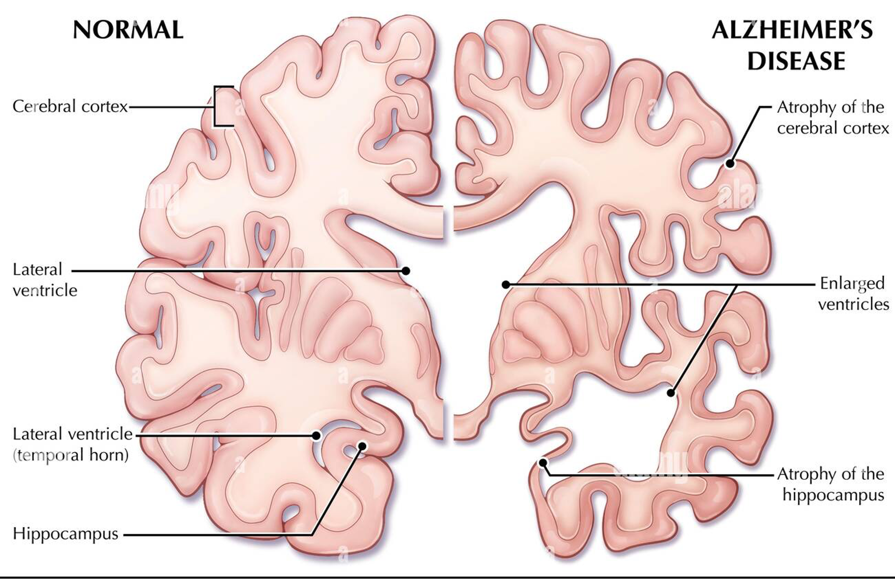

# Diagnosing Alzheimer’s from Brain MRI Scans using Pre-Trained ConvNets and Vision Transformer Models

## Overview
This project investigates the performance of convolutional neural networks (ConvNets) and Vision Transformers (ViTs) in classifying Alzheimer’s disease stages from brain MRI scans. Utilizing the ADNI dataset, the study examines the efficacy of pre-trained models, fine-tuned models, and randomly initialized transformer architectures for Alzheimer's disease diagnosis.

The primary objective is to identify optimal model architectures and configurations for accurate Alzheimer's classification, with a focus on both binary and multi-class classification tasks.

---

## Research Questions
1. **Do pre-trained ConvNet architectures learn better patterns and representations compared to state-of-the-art Vision Transformers?**  
2. **Does pre-trained Vision Transformer architecture outperform pre-trained ConvNets (e.g., VGG16, ResNet50) in Alzheimer’s classification?**  
3. **Do Vision Transformer neural networks trained from random initialization outperform pre-trained Vision Transformer models when fine-tuned on the ADNI dataset?**

---

## Experimental Setup

### Training Configurations
The following training configuration was used consistently across all models:

- **Loss**: Categorical CrossEntropy
- **Optimizer**: Adam (transfer learning), RMSprop (fine-tuning)
- **Callbacks**: ReduceLROnPlateau, EarlyStopping, ModelCheckpoint
- **Batch Size**: 32 (ConvNets), 16 (ViTs)
- **Seed**: 29
- **Image Size**: 224 (ConvNets), 384 (ViTs)

---

## Dataset
The **ADNI Dataset** was used, consisting of brain MRI scans categorized into the following classes:
1. Non-Demented
2. Very Mild Demented
3. Mild Demented
4. Moderate Demented

---

## Results

### ConvNet Performance
| **Model**       | **Loss** | **Test Accuracy** | **Precision** | **Recall** | **AUC**   |
|------------------|----------|-------------------|---------------|------------|-----------|
| InceptionV3     | 2.63     | 0.87              | 0.73          | 0.73       | 0.87      |
| Xception        | 2.28     | 0.85              | 0.69          | 0.69       | 0.87      |
| VGG16           | 1.39     | 0.81              | 0.62          | 0.60       | 0.85      |
| VGG19           | 0.94     | 0.80              | 0.63          | 0.51       | 0.85      |
| ResNet50        | 1.73     | 0.87              | 0.73          | 0.72       | 0.88      |
| ResNet152V2     | 5.85     | 0.80              | 0.60          | 0.59       | 0.83      |
| Custom CNN      | 1.39     | 0.86              | 0.72          | 0.72       | 0.89      |

### Vision Transformer Performance
| **Model**              | **Loss** | **Test Accuracy** | **Precision** | **Recall** | **AUC**   |
|-------------------------|----------|-------------------|---------------|------------|-----------|
| ViT (Random Init)      | 0.94     | 0.52              | 0.99          | 0.75       | 0.82      |
| ViT-B16 (Pre-trained)  | 0.97     | 0.50              | 0.99          | 0.56       | 0.81      |
| ViT-B32 (Pre-trained)  | 9.52     | 0.50              | 0.86          | 0.50       | 0.67      |

---

## Key Insights
1. **ConvNet Superiority**: Pre-trained ConvNets (e.g., ResNet50, Custom CNN) consistently outperformed Vision Transformers on the ADNI dataset.
2. **Vision Transformer Challenges**: Pre-trained Vision Transformers exhibited significant overfitting to the dominant class (Non-Demented), highlighting limitations in handling imbalanced datasets.
3. **Random Initialization Advantage**: Vision Transformers trained from scratch achieved better generalization than pre-trained models, albeit with lower overall performance compared to ConvNets.

---

## Figures

<!-- ### Methodology Diagram
 -->

### Normal vs Alzheimer's Brain Visualization

### InceptionV3 Results

#### GradCAM Visualization

#### Heatmap

#### Pre-Processed Image

#### Loss and Accuracy

### Vision Transformer (Random Initialization) Results

#### Attention Visualization

#### Heatmap

#### Loss and Accuracy

---

## Conclusion
This project demonstrates the strength of ConvNets in medical image classification. However, it highlights limitations in applying pre-trained Vision Transformers to specialized domains like Alzheimer's classification. Future work should focus on:

1. Utilizing larger, balanced medical datasets.
2. Exploring domain-specific pre-training for Vision Transformers.
3. Enhancing architectures for imbalanced medical imaging datasets.

---
